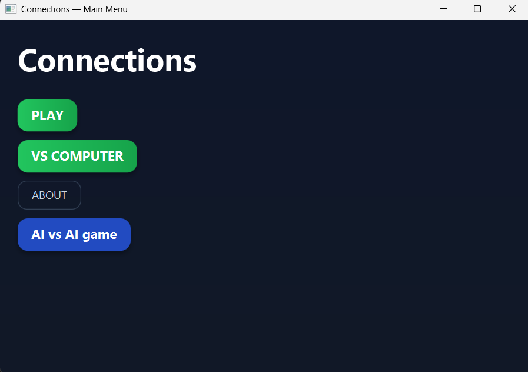
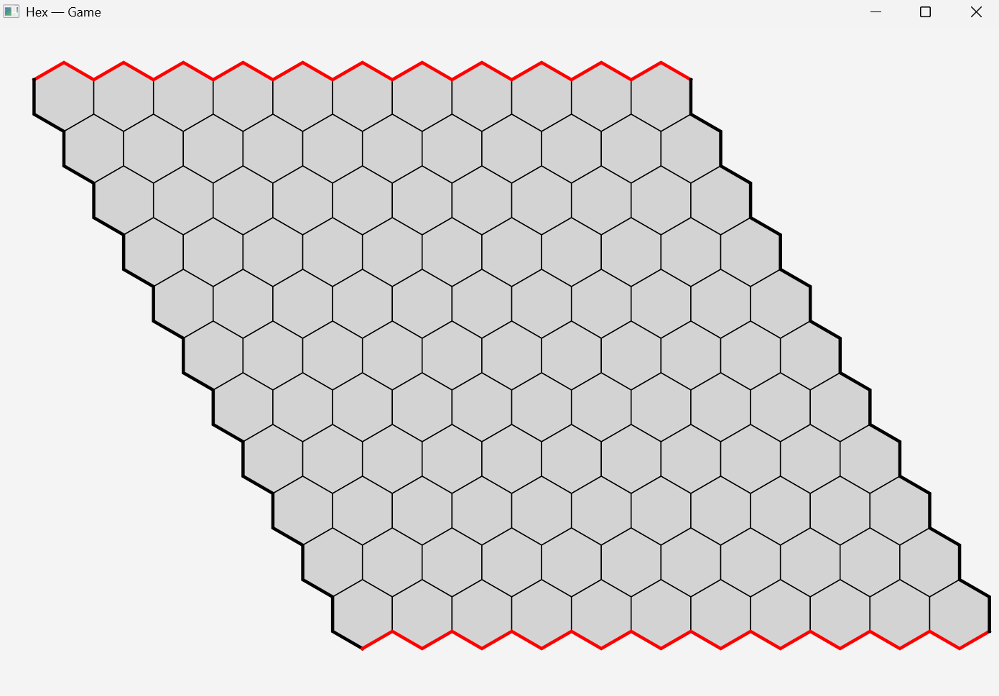

# Project 2-1 Team_04

## Name
Team_04

## Description
In this project, our team created multiple versions of the game Hex. First, a human vs human version of the game Hex was built.
For the human vs computer version of the game, multiple AI agents are implemented; an agent that uses Monte Carlo Tree Search (MCTS) and an agent that uses the machine learning technique AlphaZero.

## Visuals
### Main Menu

### Game Board

## Installation
To run this application, ensure that the following are installed:
- **Java SDK 21** or higher  
- **JavaFX SDK 17** or higher  
- **Maven**

## Methods
Monte Carlo Tree Search (MCTS) and AlphaZero were used to create different human vs computer versions of the game Hex.

### Game setup
- Hex is **n×n** board (Default 11x11).
- Board is **1D array**(due to Union Find and ML algorithms).
- **Union–Find** structure is used to check for winning conditions.
- After each move, the current state becomes **the new MCTS root** and we reuse the existing subtree.

### Base MCTS
- 4 classic MCTS steps: Selection -> Expansion -> Simulation -> Backpropagatation
- **Selection**: Uses the standard UCT formula to select a child
- **Expansion**: Creates a random promising move
- **Simulation**: Plays random moves from the child node till the game is terminated
- **Backpropragation**: After game termination updates all the parent nodes
- Fixed number of iterations

### Optimized MCTS
- Uses **same tree structure and number of simulations** as the base MCTS
- Changed rollout policy:
Instead of random moves, rollouts are biased by simple Hex heuristics
(Thresholds, Centrality, Connectivity, Bias, Shortest-paths) with weights
THR, CENT, CONN, BIAS, SP.
- Achieving better accuracy and using game logic to win

### Tuner
- For each simulation chooses **random value** in the given interval
- Compares to the **previous configurations**
- After **set number amount of simulations** return the best configuration with **highest winrate**

### Experiments
- Comparison of different **c-values (0.5, 0.8, 1.0, sqrt(1.4), 2.0)** for different type of agents.
- Comparison of **increasing number of iterations** againist a **Random baseline agent**
- Comparison of **Base MCTS vs Optimized MCTS**
- Colors are alternated between games to reduce first-move advantage
- For **Base vs Optimized** experiments both agents uses **same number of iterations**
- **For each experiment we log results into CSV**

## Usage
To run the app (make sure installation is done), run the following in the terminal: " mvn clean javafx:run ". 
This command will open our application and you will see the main menu of our application, where you can see multiple options to either play the game yourself, or watch a match between two AI agents.
If you do not know the rules of the game, the 'About' button will navigate you to the pdf document that contains the rules of the game Hex.

## Support
All project members could help you with support when necessary. Please do not hesitate to reach out to our team if you have questions.

## Authors

- Lara Oriol (i6440973)
- Noortje van Maldegem (i6374487)
- Bartlomiej Kaczor (i6395982)
- Jan Nguyen (i6391425)
- Ceausescu Cezar (i6442579)
- Arda Ayyildizbayraktar (i6300529)
- Elena Gostiukhina (i6401819)